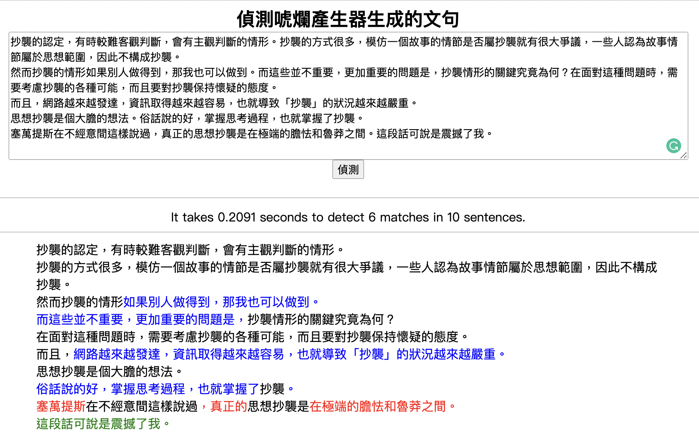

# bullshit_text_detector

唬爛產生器生成文句偵測器（簡稱：唬爛文偵測器）

Detector of texts generated by bullshit generator

## 重要說明
1. 「唬爛產生器」由作者 **徐子修 Bill Hsu** 原創：
  - 可透過 [Bullshit generator](https://github.com/StillFantastic/bullshit "唬爛產生器") 來預覽或下載使用。
  - 亦可到 [demo](https://howtobullshit.me/ "線上展示") 進行線上操作。
  - 以上連結皆由 Bill Hsu 提供。
2. 原始程式以 Go 語言進行撰寫，** 楊德倫 (https://github.com/telunyang) ** 將其改為 Python 版本。
3. 「唬爛文偵測器」（本程式），由 ** 曾元顯 ** 撰寫，目的為教學，並提供老師們運用。
4. 「唬爛文偵測器」包含了** 楊德倫 (https://github.com/telunyang) ** 撰寫的「唬爛產生器」Python版本與說明文件。

## 檔案下載
1. 請先行下載「唬爛產生器」作者的語錄資料: [下載 data.json](https://raw.githubusercontent.com/StillFantastic/bullshit/master/generator/data.json "data.json")
2. 將 data.json 放到專案目錄下即可。

## 環境需求與程式安裝
- Python 3.6 以上
- 程式安裝：
  1. 下載程式：
```bash
git clone git@github.com:SamTseng/bullshit_text_detector.git
```
或是直接到`https://github.com/SamTseng/bullshit_text_detector` 下載 `bullshit_text_detector-main.zip` 解壓縮後，將目錄名稱改成：`bullshit_text_detector`。

  2. 安裝套件：
```bash
pip install -r requirements.txt
```

## 執行方式：唬爛文句偵測
```bash
cd bullshit_text_detector

python detect.py
```
Running on http://localhost:5005/ (Press CTRL+C to quit)

請拷貝上面的網址，貼到瀏覽器後按Enter鍵，即可看到偵測畫面。

## 試驗流程：
### 1. 先以唬爛生成器生成一篇文章，如下：
```bash
python detect.py cmd

請輸入主題: (你的自訂主題)
請輸入最少字數: (希望最少生成多少字數)
...
...
(生成結果)
```
以「抄襲」為主題，生成250字的結果，範例如下：
```
如果別人做得到，那我也可以做到。而這些並不是完全重要，更加重要的問題是，問題的關鍵究竟為何？
在面對這種問題時，務必詳細考慮抄襲的各種可能。儘管如此，我們仍然需要對抄襲保持懷疑的態度。
既然如此，網路越來越發達，資訊取得越來越容易，也就導致「抄襲」的狀況越來越嚴重。
這必定是個前衛大膽的想法。俗話說的好，掌握思考過程，也就掌握了抄襲。
塞萬提斯在不經意間這樣說過，真正的勇氣在極端的膽怯和魯莽之間。這段話可說是震撼了我。
```

### 2. 人工潤飾上面的文章，如下：
```
抄襲的認定，有時較難客觀判斷，會有主觀判斷的情形。抄襲的方式很多，模仿一個故事的情節是否屬抄襲就有很大爭議，一些人認為故事情節屬於思想範圍，因此不構成抄襲。
然而抄襲的情形如果別人做得到，那我也可以做到。而這些並不重要，更加重要的問題是，抄襲情形的關鍵究竟為何？在面對這種問題時，需要考慮抄襲的各種可能，而且要對抄襲保持懷疑的態度。
而且，網路越來越發達，資訊取得越來越容易，也就導致「抄襲」的狀況越來越嚴重。
思想抄襲是個大膽的想法。俗話說的好，掌握思考過程，也就掌握了抄襲。
塞萬提斯在不經意間這樣說過，真正的思想抄襲是在極端的膽怯和魯莽之間。這段話可說是震撼了我。
```

### 3. 提交給偵測器偵測，結果如圖：

有顏色的文字（藍色、紅色、綠色、橘色），都是唬爛生成器生成的文字。亦即，有顏色者都是來自於事先建好的語錄[data.json](https://raw.githubusercontent.com/StillFantastic/bullshit/master/generator/data.json "data.json")。
